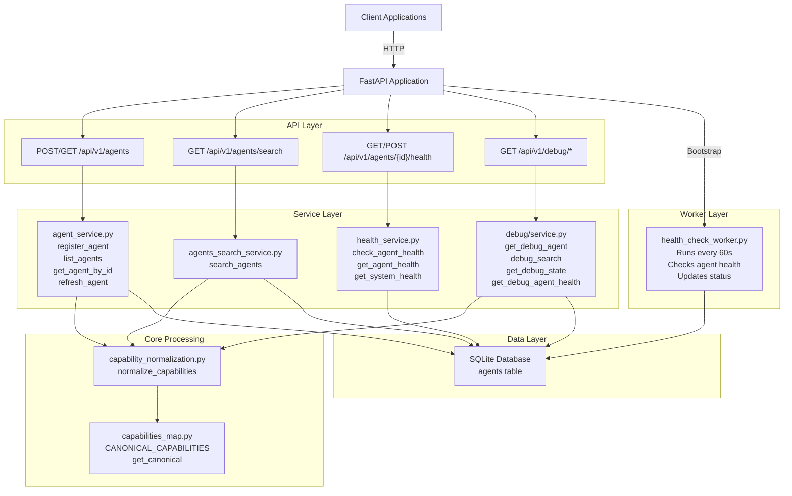
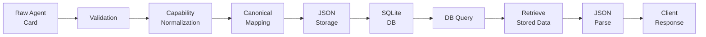

# AgentMesh Architecture

## Overview

AgentMesh is an AI Agent Registry compatible with the Google A2A (Agent-to-Agent) protocol. The system provides deterministic agent registration, discovery, health monitoring, and capability normalization.

## System Architecture



## Data Flow



## Module Organization

### API Layer (`app/api/routes/`)
- **agents.py**: Agent registration, retrieval, refresh
  - POST /api/v1/agents - Register agent
  - GET /api/v1/agents - List agents with filters
  - GET /api/v1/agents/{agent_id} - Get specific agent
  - POST /api/v1/agents/{agent_id}/refresh - Refresh agent

- **agents_search.py**: Agent discovery
  - GET /api/v1/agents/search - Search with deterministic filtering

- **health.py**: Health monitoring endpoints
  - GET /api/v1/health - System health
  - GET /api/v1/agents/{agent_id}/health - Agent health

### Service Layer (`app/services/`)
- **agent_service.py**: Core agent management logic
  - `register_agent()` - Validates, normalizes, stores agents
  - `list_agents()` - Filters agents by status/capability
  - `get_agent_by_id()` - Retrieves single agent
  - `refresh_agent()` - Updates agent from URL
  - `store_agent()` - Persists to database

- **agents_search_service.py**: Deterministic search
  - `search_agents()` - Multi-filter agent search with AND semantics

- **health_service.py**: Health check operations
  - `check_agent_health()` - Pings agent health endpoint
  - `update_agent_health_status()` - Updates database
  - `get_agent_health()` - Retrieves agent health
  - `get_system_health()` - Aggregates system metrics

### Core Processing (`app/core/`)
- **capability_normalization.py**: Capability processing pipeline
  - Lowercase
  - Trim spaces
  - Replace "-" and "_" with spaces
  - Canonical mapping
  - Deduplication

- **capabilities_map.py**: Canonical definitions
  - CANONICAL_CAPABILITIES dict: weather, finance, travel, observability, infrastructure, ai ml, general
  - `get_canonical()` - Maps normalized term to canonical category

### Data Layer (`app/db/`)
- **database.py**: SQLite persistence
  - `init_db()` - Creates schema
  - `get_db_connection()` - Context manager for connections

### Worker Layer (`app/workers/`)
- **health_check_worker.py**: Background health monitoring
  - Async task running every 60 seconds
  - Fetches from /.well-known/health endpoint
  - Updates latency_ms and status
  - Updates last_seen timestamp

### Debug Layer (`app/debug/`)
- **service.py**: Read-only observability
  - `get_debug_agent()` - Full agent metadata
  - `debug_search()` - Search trace with normalization steps
  - `get_debug_state()` - System state summary
  - `get_debug_agent_health()` - Health history

- **routes.py**: Debug endpoints
  - GET /api/v1/debug/agents/{agent_id}
  - GET /api/v1/debug/search
  - GET /api/v1/debug/state
  - GET /api/v1/debug/health/{agent_id}

## Database Schema

### agents table
```sql
CREATE TABLE agents (
    id TEXT PRIMARY KEY,
    name TEXT,
    description TEXT,
    url TEXT,
    version TEXT,
    capabilities TEXT,  -- JSON: {raw_capabilities, normalized_capabilities, canonical_capabilities}
    raw_agent_card TEXT,  -- JSON: Complete A2A agent card
    status TEXT,  -- "healthy" or "unhealthy"
    latency_ms INTEGER,  -- Last health check latency
    last_seen TEXT  -- ISO timestamp of last health check
)
```

## Capability Normalization Pipeline

1. **Input**: Raw capability string
2. **Normalize**:
   - Convert to lowercase
   - Trim whitespace
   - Replace "-" and "_" with spaces
3. **Canonical Mapping**: Look up in capabilities_map.py
4. **Deduplication**: Remove duplicates
5. **Output**: Three lists stored in JSON
   - raw_capabilities: Original input
   - normalized_capabilities: Step 2 output
   - canonical_capabilities: Step 3 output

## A2A Protocol Compliance

- Preserves raw agent card structure
- Preserves field semantics
- Validates against A2A schema (requires name field)
- Maintains interoperability with external registries
- Supports .well-known/agent.json endpoint discovery

## Worker Execution Model

- **Execution**: Async background task in FastAPI process
- **Interval**: 60 seconds
- **Method**: In-process asyncio (no external scheduler)
- **Function**: Health check with latency measurement
- **Lifecycle**: Started on app startup, cancelled on shutdown

## Response Format

All responses follow deterministic, A2A-compatible JSON structure:

- No response wrapping
- No hidden metadata
- Snake_case field naming
- Immutable response shapes per API Contract

## Key Design Decisions

1. **Single SQLite table**: No schema normalization
2. **Deterministic IDs**: Generated from name or card hash
3. **In-process workers**: No Celery, Redis, or external schedulers
4. **Strict layer separation**: Routes → Services → DB
5. **Minimal instrumentation**: Debug layer adds observability without mutating logic
6. **Canonical capabilities**: Single source of truth in capabilities_map.py
7. **Immutable API contract**: Debug endpoints are additive, never modify existing endpoints
