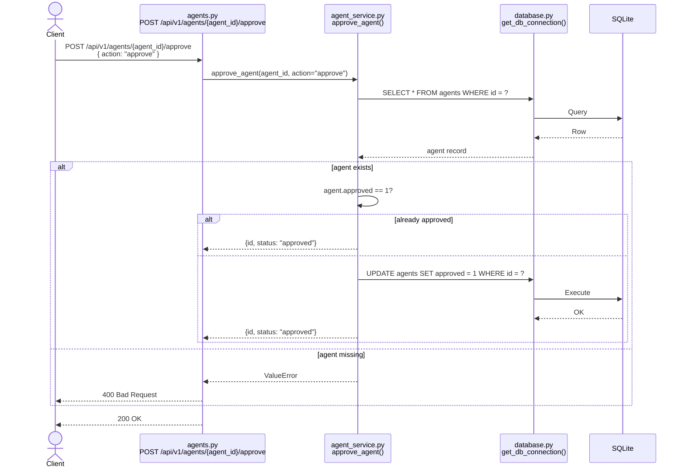

# Agent Approval Sequence

## Flow

```mermaid
sequenceDiagram
    actor Client
    participant API as agents.py<br/>POST /api/v1/agents/{agent_id}/approve
    participant Service as agent_service.py<br/>approve_agent()
    participant DB as database.py<br/>get_db_connection()
    participant SQLite as SQLite

    Client->>API: POST /api/v1/agents/{agent_id}/approve<br/>{ action: "approve" }
    API->>Service: approve_agent(agent_id, action="approve")
    Service->>DB: SELECT * FROM agents WHERE id = ?
    DB->>SQLite: Query
    SQLite-->>DB: Row
    DB-->>Service: agent record
    alt agent exists
        Service->>Service: agent.approved == 1?
        alt already approved
            Service-->>API: {id, status: "approved"}
        else
            Service->>DB: UPDATE agents SET approved = 1 WHERE id = ?
            DB->>SQLite: Execute
            SQLite-->>DB: OK
            Service-->>API: {id, status: "approved"}
        end
    else agent missing
        Service-->>API: ValueError
        API-->>Client: 400 Bad Request
    end
    API-->>Client: 200 OK
```
