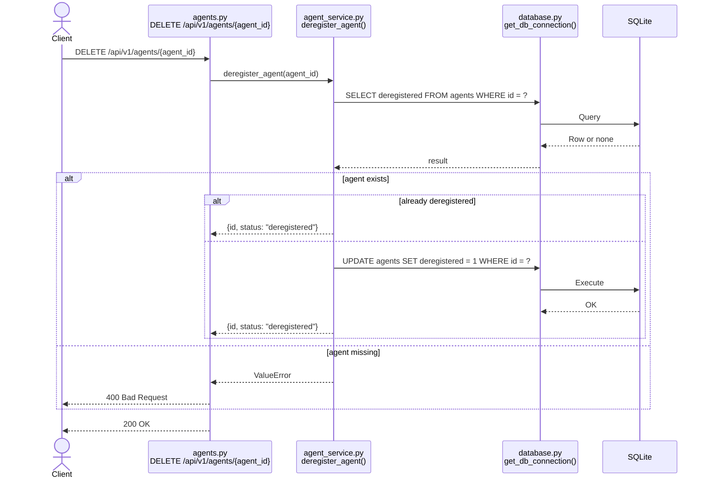

# Agent Deregistration Sequence

## Flow

```mermaid
sequenceDiagram
    actor Client
    participant API as agents.py<br/>DELETE /api/v1/agents/{agent_id}
    participant Service as agent_service.py<br/>deregister_agent()
    participant DB as database.py<br/>get_db_connection()
    participant SQLite as SQLite

    Client->>API: DELETE /api/v1/agents/{agent_id}
    API->>Service: deregister_agent(agent_id)
    Service->>DB: SELECT deregistered FROM agents WHERE id = ?
    DB->>SQLite: Query
    SQLite-->>DB: Row or none
    DB-->>Service: result
    alt agent exists
        alt already deregistered
            Service-->>API: {id, status: "deregistered"}
        else
            Service->>DB: UPDATE agents SET deregistered = 1 WHERE id = ?
            DB->>SQLite: Execute
            SQLite-->>DB: OK
            Service-->>API: {id, status: "deregistered"}
        end
    else agent missing
        Service-->>API: ValueError
        API-->>Client: 400 Bad Request
    end
    API-->>Client: 200 OK
```
