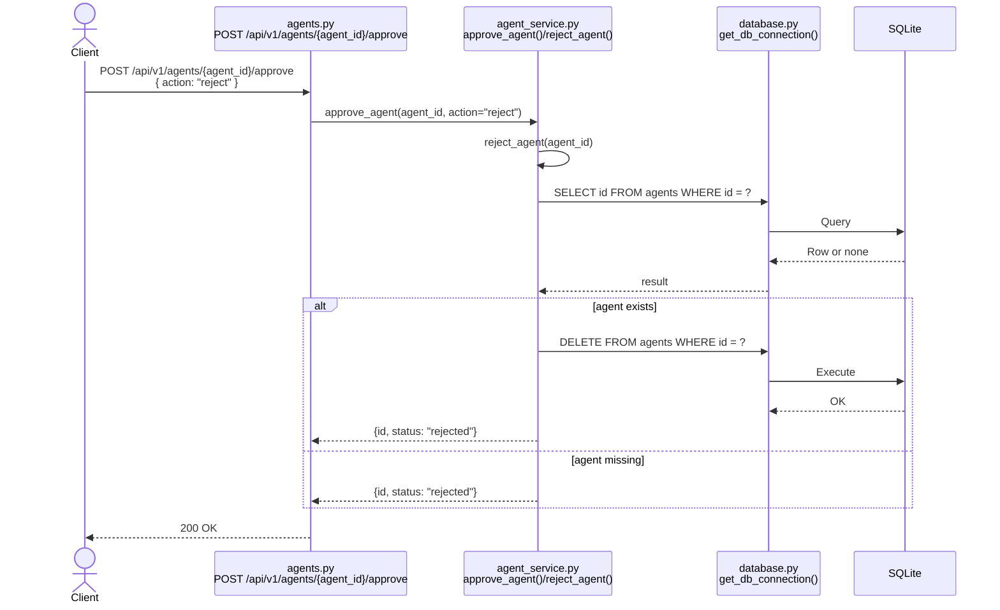

# Agent Rejection Sequence

## Flow

```mermaid
sequenceDiagram
    actor Client
    participant API as agents.py<br/>POST /api/v1/agents/{agent_id}/approve
    participant Service as agent_service.py<br/>approve_agent()/reject_agent()
    participant DB as database.py<br/>get_db_connection()
    participant SQLite as SQLite

    Client->>API: POST /api/v1/agents/{agent_id}/approve<br/>{ action: "reject" }
    API->>Service: approve_agent(agent_id, action="reject")
    Service->>Service: reject_agent(agent_id)
    Service->>DB: SELECT id FROM agents WHERE id = ?
    DB->>SQLite: Query
    SQLite-->>DB: Row or none
    DB-->>Service: result
    alt agent exists
        Service->>DB: DELETE FROM agents WHERE id = ?
        DB->>SQLite: Execute
        SQLite-->>DB: OK
        Service-->>API: {id, status: "rejected"}
    else agent missing
        Service-->>API: {id, status: "rejected"}
    end
    API-->>Client: 200 OK
```
