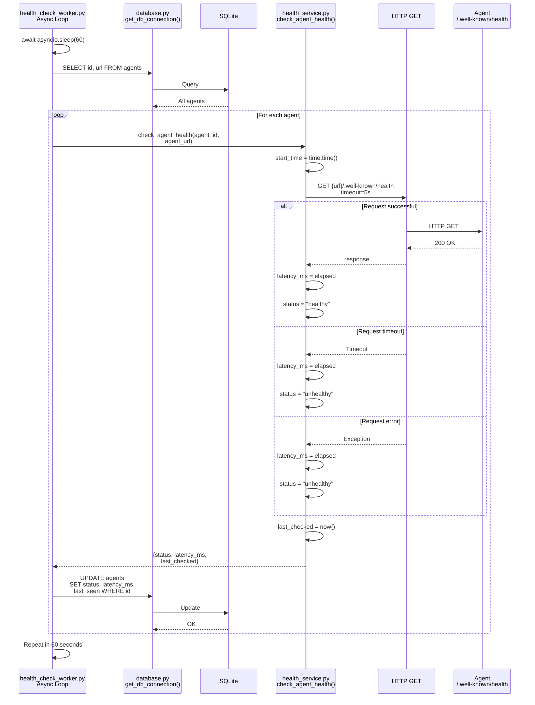
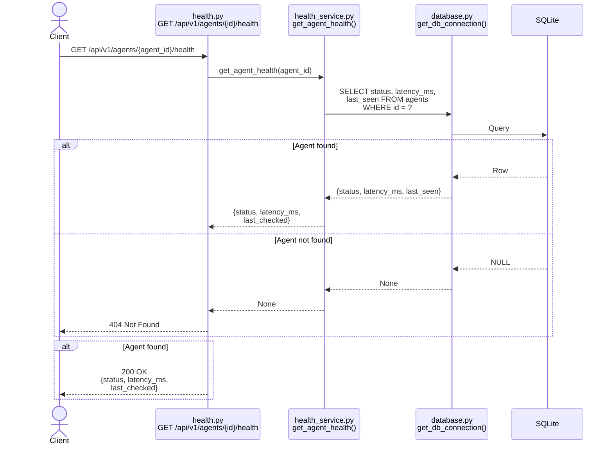

# Health Check Sequence

## Background Worker (Every 60 seconds)



## On-Demand Health Check (Client Request)



## System Health (Aggregated)

```mermaid
sequenceDiagram
    actor Client
    participant API as health.py<br/>GET /api/v1/health
    participant Service as health_service.py<br/>get_system_health()
    participant DB as database.py<br/>get_db_connection()
    participant SQLite as SQLite

    Client->>API: GET /api/v1/health
    
    API->>Service: get_system_health()
    
    Service->>DB: SELECT status, latency_ms<br/>FROM agents
    DB->>SQLite: Query
    SQLite-->>DB: All agents
    
    Service->>Service: Count by status
    Service->>Service: Calculate average latency
    
    Service-->>API: {agents_total,<br/>healthy, unhealthy,<br/>avg_latency_ms}
    API-->>Client: 200 OK
