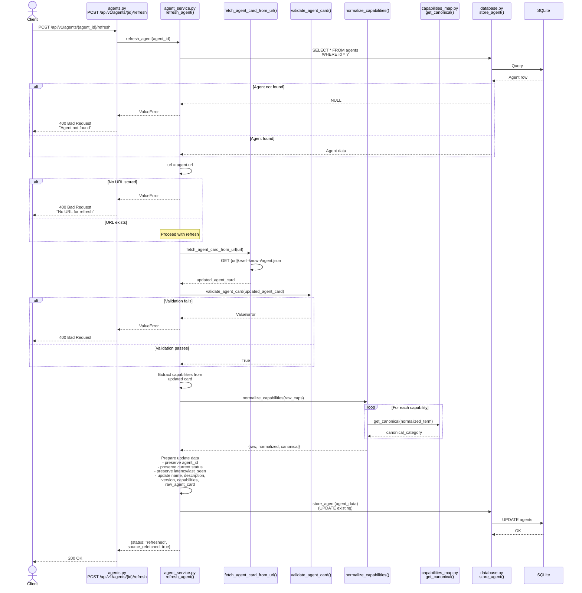

# Agent Refresh Sequence

## Refresh Agent Flow

## Key Preservation Rules

- **agent_id**: Preserved (deterministic, immutable)
- **status**: Preserved (current health status)
- **latency_ms**: Preserved (from last health check)
- **last_seen**: Preserved (timestamp of last health check)
- **url**: Preserved (original registration URL)
- **updated fields**:
  - name
  - description
  - version
  - capabilities (re-normalized)
  - raw_agent_card (latest version)
